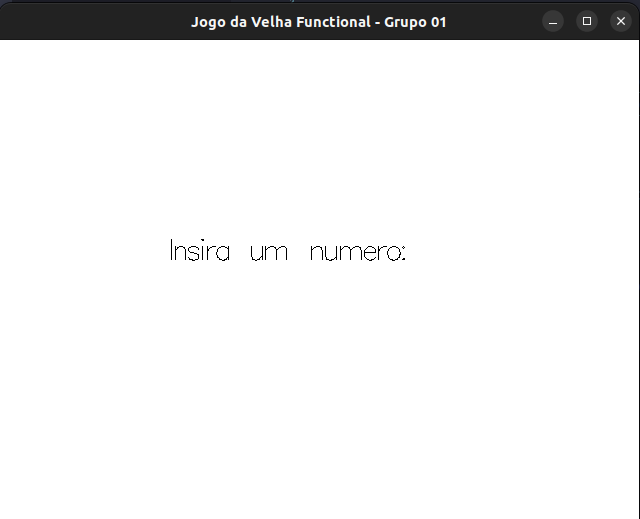
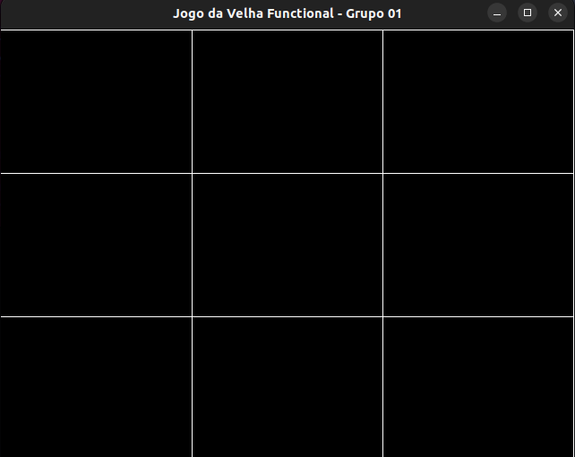

# 2023.2_G1_Funcional

**Disciplina**: FGA0210 - PARADIGMAS DE PROGRAMAÇÃO - T01 <br>
**Nro do Grupo (de acordo com a Planilha de Divisão dos Grupos)**: 01<br>
**Paradigma**: Funcional<br>

## Alunos
|Matrícula | Aluno |
| -- | -- |
| 22/2015103  |  Debora Caires de Souza Moreira |
| 18/0016067  |  Erick Levy Barbosa dos Santos |
| 20/2016480  |  Hellen Fernanda Mendonça de Faria |
| 19/0090901  |  Laura Pinos de Oliveria |
| 21/2005426  |  Lucas Gomes Caldas |
| 20/0073249  |  Pedro Vitor Augusto de Jesus |
| 18/0011472  |  Rodolfo Cabral Neves |
| 18/0027352  |  Rodrigo Carvalho dos Santos |
| 19/0037997  |  Sidney Fernando Ferreira Lemes |


## Sobre 
O projeto é uma implementação do jogo da velha em Haskell utilizando programação funcional. Ele é dividido em quatro módulos:

1. Game.hs: Define a estrutura do jogo, incluindo o estado do tabuleiro e a lógica para jogadas. Permite aos jogadores realizar movimentos válidos e verifica o resultado do jogo.
2. Logic: Contém a lógica central do jogo, determinando vitória, empate e outras regras fundamentais.
3. Rendering: Trata da representação visual ou textual do jogo, exibindo o tabuleiro e informando o estado atual após cada jogada.
4. Main: Ponto de entrada do programa, coordena a execução geral do jogo, inicializando-o, alternando jogadores e controlando o fluxo até um vencedor ou empate.

## Screenshots




## Instalação 
**Linguagens**: Haskell<br>
**Tecnologias**: stack, gloss<br>

## Uso 

### Comandos para distros baseados em Ubuntu

```bash
    sudo apt install haskell-platform stack ghc-OpenGLRaw-devel ghc-GLURaw-devel -y
    
    # Entre na pasta do jogo
    cd jogo-da-velha
    
    # compila o projeto
    stack build

    # executa o projeto
    stack exec jogo-da-velha-exe
```

## Vídeo
<!-- Adicione 1 ou mais vídeos com a execução do projeto.
Procure: 
(i) Introduzir o projeto;
(ii) Mostrar passo a passo o código, explicando-o, e deixando claro o que é de terceiros, e o que é contribuição real da equipe;
(iii) Apresentar particularidades do Paradigma, da Linguagem, e das Tecnologias, e
(iV) Apresentar lições aprendidas, contribuições, pendências, e ideias para trabalhos futuros.
OBS: TODOS DEVEM PARTICIPAR, CONFERINDO PONTOS DE VISTA.
TEMPO: +/- 15min -->

## Participações
Apresente, brevemente, como cada membro do grupo contribuiu para o projeto.
|Nome do Membro | Contribuição | Significância da Contribuição para o Projeto (Excelente/Boa/Regular/Ruim/Nula) |
| -- | -- | -- |
| Debora Caires de Souza Moreira    |  | Regular |
| Erick Levy Barbosa dos Santos     |  | Regular |
| Hellen Fernanda Mendonça de Faria |  | Regular |
| Laura Pinos de Oliveria           |  | Regular |
| Lucas Gomes Caldas                |  | Regular |
| Pedro Vitor Augusto de Jesus      |  | Regular |
| Rodolfo Cabral Neves              |  | Regular |
| Rodrigo Carvalho dos Santos       |  | Regular |
| Sidney Fernando Ferreira Lemes    |  | Regular |
## Board
https://github.com/orgs/UnBParadigmas2023-2/projects/2/views/1

## Fontes
[Haskel Stack](https://docs.haskellstack.org/)
[[Part 2] Tic-tac-toe Game in Haskell -- Procedural vs Functional](https://www.youtube.com/watch?v=VxLvaHpAK-U&t=263s)
